# Penny Pilot

Penny Pilot is a personal finance operating system for tracking income, expenses, investments, and spending limits across multiple accounts and payment methods. It adds structured insight on top of the raw numbers so the app can answer not just "what happened" but "does it matter?"

## Snapshot

| Area             | Summary                                                      |
|------------------|--------------------------------------------------------------|
| Product          | Personal finance dashboard with auth, budgets, limits, and insight |
| Frontend         | React 19, Vite, Tailwind CSS, React Router, Framer Motion, Recharts |
| Backend          | Node.js, Express 5, Prisma ORM, PostgreSQL, JWT, bcrypt      |
| External services| Google OAuth, Groq, Financial Modeling Prep, AMFI India      |
| Core idea        | Model money as accounts and payment methods                  |

## The Problem

Most budgeting tools flatten finance into a transaction list. That works for simple expense tracking, but it breaks down when money flows through:

- salary accounts
- UPI wallets
- credit cards
- investment accounts
- shared or split expenses

That flattening hides relationships between accounts, payment methods, and time-based behavior. The result is a dashboard that can count money but cannot explain it.

Penny Pilot is built around a different assumption:

| Traditional budgeting app | Penny Pilot                          |
|---------------------------|--------------------------------------|
| Flat transaction list     | Account-centric model                |
| Generic summaries         | Per-account and per-method analysis  |
| Passive reporting         | Limit enforcement and anomaly signals|
| Freeform AI narration     | Data-constrained insight generation  |

## What It Does

| Capability         | What it provides                                      |
|-------------------|--------------------------------------------------------|
| Income tracking   | Salary and non-salary inflows with account scoping     |
| Expense tracking  | Category-aware spending with payment-method context    |
| Investment tracking | Ledger-based holdings and market-linked analysis    |
| Limit enforcement | Guardrails for daily, weekly, and monthly spend limits |
| Auth              | Email/password plus Google OAuth                       |
| Insight layer     | Risk, concentration, and behavior summaries           |

## Architecture

### System Layers

| Layer       | Role                                           |
|-------------|------------------------------------------------|
| Client      | React UI, auth state, route protection, API calls |
| Middleware  | Auth checks and expense limit enforcement      |
| Controllers | Request routing for each resource domain       |
| Services    | Business rules and integrations                |
| Database    | PostgreSQL via Prisma                          |
| External APIs | Google OAuth, Groq, FMP, AMFI                |

## Visual Summary

| Question                              | Diagram |
|---------------------------------------|---|
| How does a request move through the system? | [Request lifecycle](docs/diagrams/request-lifecycle.svg) |
| How is auth kept secure?              | [Auth rotation](docs/diagrams/auth-rotation.svg) |
| How are entities connected?           | [Data model](docs/diagrams/data-model.svg) |
| What is the overall system shape?     | [Architecture](docs/diagrams/architecture.svg) |

## Design Principles

| Principle              | Implementation                                 |
|------------------------|------------------------------------------------|
| Clarity over noise     | Finance data is grouped by account, method, and period |
| Safety over convenience| Sessions rotate and reuse is detected          |
| Insight over reporting | Dashboards compute meaning, not just totals    |
| Integration over duplication | External APIs are normalized into shared shapes |
| Maintainability over shortcuts | Business rules live in services and middleware |

