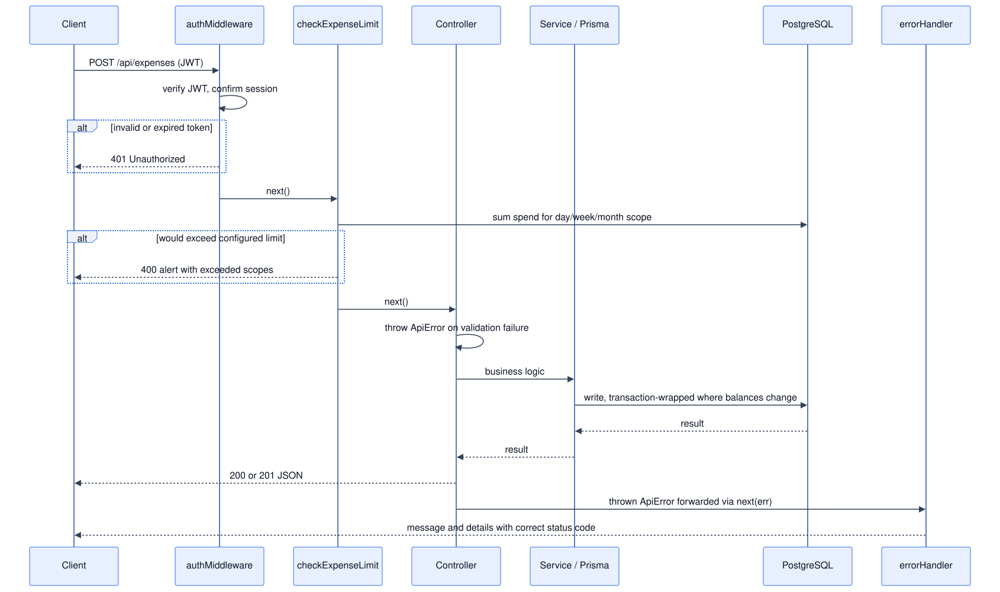
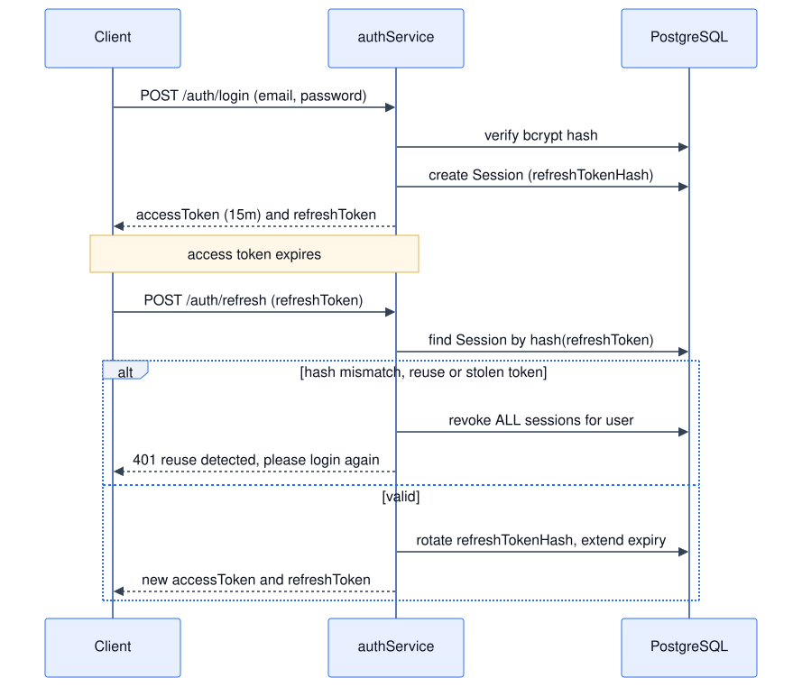

# Penny Pilot

**A personal finance operating system** — one place to track income, expenses, investments, and spending limits across multiple accounts and payment methods, with AI-generated insight on top of the numbers.

Most budgeting apps stop at "you spent ₹12,000 this month." Penny Pilot goes further: it correlates income stability, spending anomalies, investment concentration, and burn rate into a single risk forecast, and lets an LLM narrate what the numbers actually mean — scoped per account, per payment method, per timeframe.

---

## The problem

Personal finance data is naturally fragmented — a salary account, a UPI wallet, a couple of credit cards, a demat account, all telling a different slice of the same story. Spreadsheets don't scale across that, and most budgeting apps only show *what happened*, not *whether it matters*.

Penny Pilot's core bet: **model money as a graph of accounts and payment methods, not a flat list of transactions** — then compute insight (anomalies, concentration, runway) on top of that graph instead of asking the user to read a spreadsheet.

---

## Architecture


**Frontend:** React 19, Vite, Tailwind CSS, React Router, Framer Motion, Recharts, Axios
**Backend:** Node.js, Express 5, Prisma ORM, PostgreSQL, JWT, bcrypt
**External integrations:** Google OAuth, Groq (LLM insight generation), Financial Modeling Prep (live equity/ETF quotes), AMFI India (mutual fund NAVs, scraped + cached)

---

## Data model

The schema is built around **accounts as the hub** — every income, expense, and investment transaction is scoped to an account and a payment method, which is what makes per-account / per-method filtering on the dashboard possible instead of just per-user totals.



24 Prisma models in total — the diagram above shows the load-bearing core (accounts, transactions, limits, instruments). The rest of the schema covers EMIs/loans, split expenses, insurance, and goals as append-only ledgers off the same `User`.

---

## Request lifecycle

Every mutating request flows through the same pipeline, so business rules (like limit enforcement) are enforced once, centrally — not re-implemented per endpoint.



---

## Auth: refresh-token rotation with reuse detection

Access tokens are short-lived (15 min). Refresh tokens are long-lived, **hashed at rest**, rotated on every use, and checked for reuse — if a refresh token is presented twice, every session for that user is revoked immediately (the standard defense against a leaked refresh token being replayed).



The Axios client mirrors this on the frontend: a single in-flight refresh promise (so concurrent 401s don't trigger a refresh storm), automatic retry of the original request, and a hard redirect to `/login` if refresh itself fails.

---

## What's actually interesting under the hood

- **Decimal-safe money math.** Every currency value is a Prisma `Decimal`, not a float — deliberately, to avoid the classic `0.1 + 0.2 !== 0.3` class of bug in financial calculations.
- **Scenario-aware dashboard queries.** The advanced dashboard endpoint accepts an `accountId` and `methodType` filter and re-derives every aggregate (income, expense, investment cash flow, category breakdown, anomaly detection) scoped to that slice — without a second set of endpoints.
- **BUY/SELL-aware portfolio accounting.** Investment holdings are computed from a full transaction ledger (not a mutable "current position" row), using weighted-average cost basis so realized/unrealized P&L stay correct across partial sells.
- **Two live market-data sources, one interface.** Equities/ETFs come from Financial Modeling Prep; Indian mutual funds come from a scraped-and-cached AMFI NAV feed — both normalized into the same `Instrument`/`InstrumentQuote` shape so the rest of the app doesn't care which source a holding came from.
- **LLM insight is data-constrained, not freeform.** The prompt sent to Groq is a structured JSON payload (already-computed anomalies, stability scores, concentration metrics) with an explicit "do not invent values" instruction — the model narrates pre-computed facts rather than hallucinating analysis.

---

## Project structure

```
client/               React + Vite frontend
  src/pages/           route-level views (Dashboard, Expense, Income, Investment, Limits, Analysis...)
  src/components/      shared UI, grouped by feature
  src/context/         auth + theme providers
  src/api/              axios client with refresh interceptor

server/                Express API
  src/controllers/      14 resource domains (account, expense, income, investment, dashboard...)
  src/services/         business logic + external API integrations
  src/middleware/        auth, limit enforcement, centralized error handling
  prisma/schema.prisma   24-model schema, 9 migrations

docs/diagrams/         Mermaid sources (.mmd) + rendered SVGs used above
```

Diagrams are pre-rendered to SVG so they display in any Markdown viewer. To regenerate after changing a `.mmd` source:

```bash
npx @mermaid-js/mermaid-cli -i docs/diagrams/<name>.mmd -o docs/diagrams/<name>.svg -c docs/diagrams/mermaid-config.json -b white --scale 2
```

---

## Getting started

### Prerequisites

- Node.js 18+
- PostgreSQL

### Backend

```bash
cd server
npm install
cp .env.example .env   # DATABASE_URL, JWT_SECRET, GOOGLE_CLIENT_ID, FMP_API_KEY, GROQ_API_KEY
npx prisma migrate deploy
npm run dev
```

### Frontend

```bash
cd client
npm install
cp .env.example .env    # VITE_GOOGLE_CLIENT_ID
npm run dev
```

The client expects the API at `http://localhost:3001/api` by default (configurable via `VITE_API_URL`).

### Seeding sample data

```bash
cd server
npm run seed:sample
```
